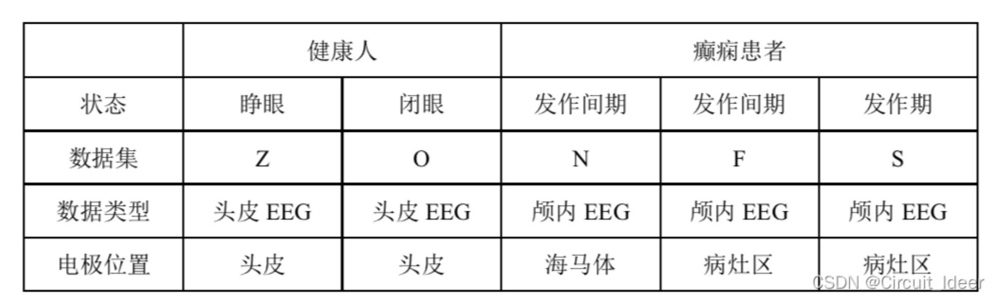
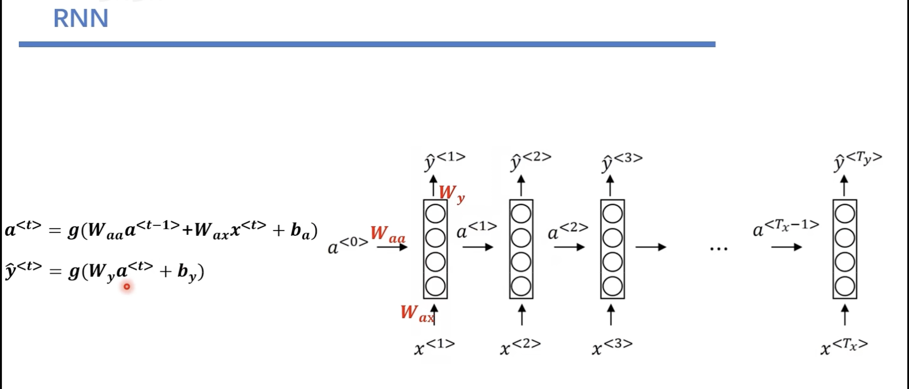
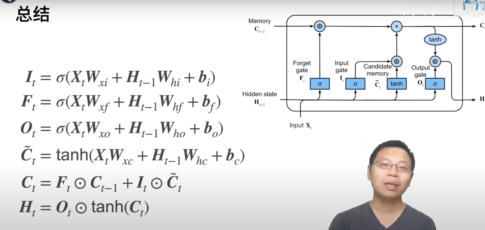
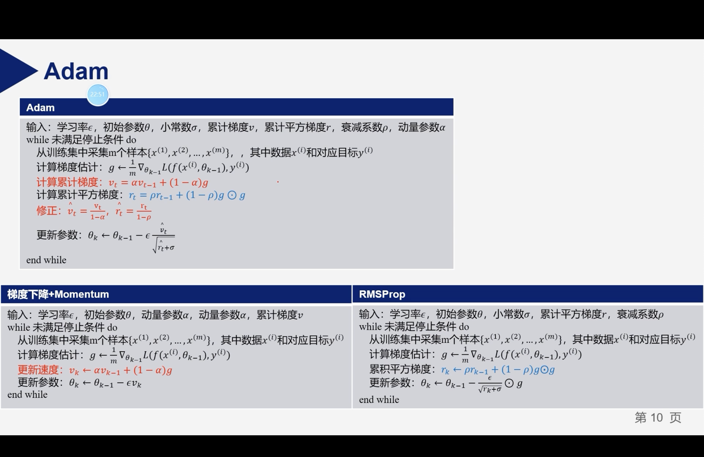

# 数据介绍

# CNN
1. CNN参数只关注**局部图像块**，而不是整个图像。这使得CNN在处理图像时非常有效，因为它可以学习到图像的局部特征，而不受图像的整体变化的影响。这使得CNN在图像分类、目标检测和图像分割等任务中非常有效。
这样的话处理图像任务时，不会受到图片缩放、旋转、平移等操作的影响。
2. CNN**共享参数**，这使得CNN在训练时需要的参数大大减少，从而减少了过拟合的风险。这使得CNN在处理大规模图像数据时非常有效。
3. 窄卷积、宽卷积、空洞卷积
4. 为什么CNN的性能比全连接好？
    > 1. CNN的参数共享机制，使得CNN的参数大大减少，从而减少了过拟合的风险。
    > 2. CNN的局部连接机制，使得CNN只关注图像的局部特征，而不受图像的整体变化的影响。
    > 3. CNN的池化机制，使得CNN对图像的变化具有一定的鲁棒性。
    > 4. **官话**：CNN有更好的归纳偏差，强制网络以类似的方式处理每个位置，在不同位置之间共享信息，搜索较小的输入/输出映射族，其中所有映射都是合理的。

# LSTM
1. LSTM的前身是RNN，RNN的缺点是：1.梯度消失（弥散） 2.梯度爆炸（取决于参数是大于1还是小于1，大于1发生梯度爆炸，小于1发生梯度消失）。
2. LSTM具有三个门：输入门、遗忘门、输出门。这三个门的作用是：输入门用于控制输入的信息，遗忘门用于控制上一个时间步的信息，输出门用于控制输出的信息。还具有隐藏状态、记忆单元和候选记忆单元。
3. 
4. 

# Adam优化器

1. Adam优化器是结合了Momentum和RMSprop的优化器。
2. Adam优化器的优点是：1.自适应学习率 2.自适应动量 3.自适应梯度裁剪
3. Adam优化器可以避免冷启动，即不需要设置学习率和动量的初始值。
4. 代码中的beta_1(0.9)是图中的阿尔法，beta_2(0.999)是图中的p，学习率(0.0005)是图中的一步徐通。意味着模型的学习速度相对较慢，动量较大，学习速率的自适应调整较强。

# 参数介绍
1. 所用卷积层均采用大小为7的一维卷积核，步长为1; 
2. 所有池化层采用大小为2、步长为2、填充为1的最大池化操作;
3. 卷积块1、卷积块2和卷积块3的通道数分别设置为40、80和150。
4. LSTM层数为3，每层包含300个隐藏单元。前2个FC层的神经元个数为1024；
5. 最后一个FC层的神经元个数为分类任务的类别总数。

# SVM
1. Gamma参数是SVM中的一个核函数参数，它控制着样本点对决策边界的影响。 Gamma越大，样本点对决策边界的影响就越小，决策边界就越平滑；Gamma越小，样本点对决策边界的影响就越大，决策边界就越复杂。
2. 惩罚参数C越大，即对分错样本的惩罚程度越大,因此在训练样本中准确率越高,但是泛化能力降低,也就是对测试数据的分类准确率降低。 相反,减小c的话,允许训练样本中有一些误分类错误样本,泛化能力强。